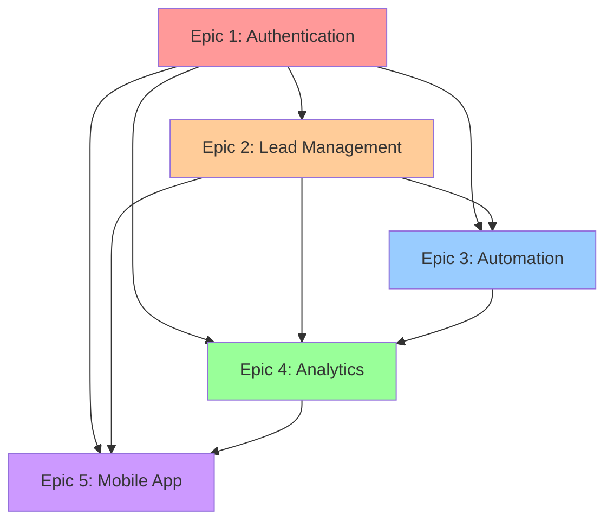

# Epic Overview - DealCycle CRM

## 📋 Project Information

| Field | Value |
|-------|-------|
| **Project** | DealCycle CRM |
| **Total Epics** | 5 |
| **Estimated Total Effort** | 19-24 weeks |
| **Priority** | High |
| **Status** | Ready for Development |

## 🎯 Project Overview

**Objective:** Build a comprehensive, modern CRM platform specifically designed for real estate wholesaling operations. The platform includes AI-powered features, automation workflows, mobile capabilities, and advanced analytics to drive business efficiency and growth.

**Business Value:**
- Streamlines lead management and qualification
- Reduces manual tasks through automation
- Provides data-driven insights for decision making
- Enables mobile field work and productivity
- Creates competitive advantage through AI features
- Supports safe deployments with feature flags

## 📊 Epic Summary

### **Epic 1: Authentication and User Management**
- **Priority:** Critical
- **Effort:** 3-4 weeks
- **Dependencies:** None
- **Status:** Ready for Development

**Key Features:**
- Google OAuth 2.0 integration
- Multi-tenant architecture
- Role-based access control (RBAC)
- Feature flag integration
- Security audit logging

**Business Impact:**
- Enables secure platform access
- Supports multi-tenant SaaS model
- Provides granular permission control
- Ensures compliance and security

### **Epic 2: Lead Management System**
- **Priority:** Critical
- **Effort:** 4-5 weeks
- **Dependencies:** Epic 1
- **Status:** Ready for Development

**Key Features:**
- AI-powered lead scoring
- FIFO lead queue management
- Visual pipeline management
- Communication integration
- Lead enrichment and validation

**Business Impact:**
- Improves lead conversion rates
- Reduces manual data entry
- Enhances lead qualification accuracy
- Streamlines lead processing workflow

### **Epic 3: Automation Workflow Engine**
- **Priority:** High
- **Effort:** 5-6 weeks
- **Dependencies:** Epic 1, Epic 2
- **Status:** Ready for Development

**Key Features:**
- Visual workflow builder
- Trigger-based automation
- AI-powered optimization
- Workflow analytics
- Template marketplace

**Business Impact:**
- Reduces manual tasks by 70%
- Ensures consistent process execution
- Provides competitive advantage
- Enables scalable operations

### **Epic 4: Analytics and Reporting**
- **Priority:** High
- **Effort:** 4-5 weeks
- **Dependencies:** Epic 1, Epic 2, Epic 3
- **Status:** Ready for Development

**Key Features:**
- Role-based dashboards
- Real-time analytics
- AI-powered insights
- Advanced reporting
- Data visualization

**Business Impact:**
- Provides actionable business insights
- Enables data-driven decisions
- Improves team performance visibility
- Supports predictive analytics

### **Epic 5: Mobile Companion App**
- **Priority:** Medium
- **Effort:** 3-4 weeks
- **Dependencies:** Epic 1, Epic 2, Epic 4
- **Status:** Ready for Development

**Key Features:**
- Offline functionality
- Mobile-optimized interface
- Camera and location integration
- Cross-platform sync
- Push notifications

**Business Impact:**
- Enables field work productivity
- Extends CRM to mobile users
- Improves team communication
- Supports offline operations

## 🔄 Epic Dependencies

## 📈 Success Metrics

### **Overall Project Metrics**
- **Timeline:** Complete within 24 weeks
- **Quality:** > 90% test coverage
- **Performance:** < 3 second load times
- **User Satisfaction:** > 90% adoption rate
- **Business Impact:** 50% productivity improvement

### **Feature Flag Integration**
- **Safe Deployments:** 100% feature flag coverage
- **Rollback Capability:** < 5 minute rollback time
- **Gradual Rollouts:** Percentage-based deployments
- **A/B Testing:** Component-level testing support

### **Technical Excellence**
- **Security:** Zero critical vulnerabilities
- **Scalability:** Multi-tenant architecture
- **Reliability:** 99.9% uptime
- **Performance:** Optimized for all devices

## 🚀 Development Strategy

### **Phase 1: Foundation (Weeks 1-7)**
- **Epic 1:** Authentication and User Management
- **Epic 2:** Lead Management System
- **Focus:** Core platform functionality
- **Deliverable:** Working CRM with basic features

### **Phase 2: Automation (Weeks 8-13)**
- **Epic 3:** Automation Workflow Engine
- **Focus:** Process automation and efficiency
- **Deliverable:** Automated workflows and AI features

### **Phase 3: Intelligence (Weeks 14-18)**
- **Epic 4:** Analytics and Reporting
- **Focus:** Business intelligence and insights
- **Deliverable:** Comprehensive analytics platform

### **Phase 4: Mobility (Weeks 19-24)**
- **Epic 5:** Mobile Companion App
- **Focus:** Mobile productivity and field work
- **Deliverable:** Complete mobile CRM solution

## 🔧 Technical Architecture

### **Backend Stack**
- **Framework:** NestJS with TypeScript
- **Database:** MongoDB with multi-tenant support
- **Cache:** Redis for session and feature flags
- **Authentication:** Google OAuth 2.0 + JWT
- **AI/ML:** Custom AI services for lead scoring and automation

### **Frontend Stack**
- **Framework:** Next.js 14 with TypeScript
- **UI Library:** Chakra UI with custom design system
- **State Management:** Zustand + React Query
- **Charts:** Recharts for data visualization
- **Forms:** React Hook Form + Zod validation

### **Mobile Stack**
- **Framework:** React Native / Expo
- **Offline Storage:** AsyncStorage + SQLite
- **Sync:** Custom sync service with conflict resolution
- **Push Notifications:** Expo notifications

### **Infrastructure**
- **Cloud:** Google Cloud Platform
- **CI/CD:** GitHub Actions
- **Monitoring:** Prometheus + Grafana
- **Security:** Comprehensive security measures

## 📋 Risk Management

### **Technical Risks**
- **Risk:** AI model accuracy issues
  - **Mitigation:** Human oversight and feedback loops
- **Risk:** Performance bottlenecks
  - **Mitigation:** Scalable architecture and monitoring
- **Risk:** Integration complexity
  - **Mitigation:** Feature flags for gradual rollout

### **Business Risks**
- **Risk:** User adoption challenges
  - **Mitigation:** Comprehensive user training and support
- **Risk:** Feature scope creep
  - **Mitigation:** Strict scope management and prioritization
- **Risk:** Timeline delays
  - **Mitigation:** Agile development with regular checkpoints

### **Security Risks**
- **Risk:** Data security vulnerabilities
  - **Mitigation:** Comprehensive security testing and audits
- **Risk:** Multi-tenant data isolation
  - **Mitigation:** Rigorous testing and validation
- **Risk:** API security issues
  - **Mitigation:** Rate limiting and input validation

## 🎯 Definition of Success

### **Technical Success**
- All epics completed within timeline
- > 90% test coverage achieved
- Performance requirements met
- Security requirements satisfied
- Feature flag system operational

### **Business Success**
- 90%+ user adoption rate
- 50%+ productivity improvement
- Significant cost savings achieved
- Competitive advantage established
- Scalable SaaS platform ready

### **Quality Success**
- Zero critical bugs in production
- 99.9% system uptime
- < 3 second response times
- Comprehensive documentation
- User satisfaction > 90%

---

**This epic overview provides a comprehensive roadmap for building the DealCycle CRM platform, ensuring successful delivery of a modern, efficient, and competitive CRM solution.** 