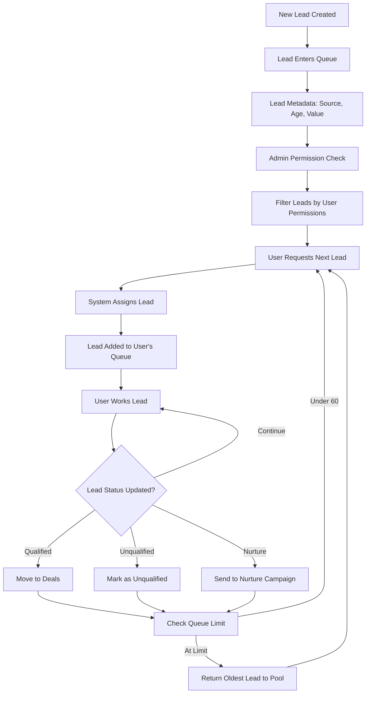

# 🎨 Front-End Specification - Presidential Digs CRM

## 📋 Document Information

| Field | Value |
|-------|-------|
| **Document Type** | Front-End Specification |
| **Project** | Presidential Digs CRM |
| **Version** | 1.0 |
| **Created** | 2024-12-19 |
| **Owner** | UX Expert |
| **Status** | Draft |

---

## 🎯 Executive Summary

**Presidential Digs CRM** is a modern, multi-tenant SaaS platform designed specifically for real estate wholesaling operations. This front-end specification defines the complete user interface architecture, design system, and user experience requirements for a desktop-first CRM that prioritizes efficiency, data visualization, and streamlined workflows.

**Key Design Principles:**
- **Desktop-First Design** - Optimized for computer-based workflows
- **Modern SaaS Aesthetics** - Clean, professional interface inspired by modern tools like Cursor
- **Efficiency-Driven UX** - Streamlined workflows for high-volume lead processing
- **Real-Time Collaboration** - Live updates and multi-user coordination
- **Accessibility-First** - Inclusive design for all users

---

## 👥 Target User Personas

### **Primary Users**

#### **1. Acquisition Representatives**
**Role:** Lead generation and seller communication
**Workflow:** High-volume lead processing, phone calls, SMS communication
**Key Needs:**
- Quick lead capture and qualification
- Efficient communication tools (SMS, calls)
- Lead queue management (FIFO system)
- Performance tracking and metrics
- Mobile companion for field work

#### **2. Disposition Managers**
**Role:** Buyer management and deal coordination
**Workflow:** Buyer matching, deal marketing, contract management
**Key Needs:**
- Buyer database management
- Deal marketing tools
- Contract and document management
- Buyer communication coordination
- Deal pipeline visualization

#### **3. Transaction Coordinators**
**Role:** Deal closing and transaction management
**Workflow:** Contract processing, closing coordination, document management
**Key Needs:**
- Transaction timeline management
- Document organization and tracking
- Closing checklist management
- Stakeholder communication
- Compliance and audit trails

#### **4. Business Owners/Admins**
**Role:** System administration and business oversight
**Workflow:** Team management, performance monitoring, system configuration
**Key Needs:**
- Comprehensive analytics and reporting
- User and permission management
- System configuration and integration
- Performance monitoring
- Cost and revenue tracking

### **Secondary Users**

#### **5. External Buyers (Future)**
**Role:** Deal viewing and claiming
**Workflow:** Self-service deal browsing and claiming
**Key Needs:**
- Deal browsing and search
- Property information and photos
- Deal claiming process
- Communication with wholesalers

---

## 🏗️ Information Architecture (IA)

### **Site Map / Screen Inventory**

```mermaid
graph TD
    A[Dashboard] --> B[Leads Management]
    A --> C[Deals Management]
    A --> D[Buyers Management]
    A --> E[Communications]
    A --> F[Documents]
    A --> G[Analytics & Reports]
    A --> H[Settings]
    A --> I[User Management]

    B --> B1[Lead Queue]
    B --> B2[Lead Details]
    B --> B3[Create Lead]
    B --> B4[Lead Pipeline]
    B --> B5[Lead Search & Filters]

    C --> C1[Deal List]
    C --> C2[Deal Details]
    C --> C3[Transaction Timeline]
    C --> C4[Contract Management]
    C --> C5[Closing Checklist]

    D --> D1[Buyer List]
    D --> D2[Buyer Profile]
    D --> D3[Buyer Preferences]
    D --> D4[Deal History]

    E --> E1[Message Center]
    E --> E2[Call Log]
    E --> E3[Text Messages]
    E --> E4[Email Templates]

    F --> F1[Document Library]
    F --> F2[Contract Templates]
    F --> F3[Upload Documents]
    F --> F4[Document Search]

    G --> G1[Performance Dashboard]
    G --> G2[Lead Analytics]
    G --> G3[Deal Analytics]
    G --> G4[Revenue Reports]
    G --> G5[Team Performance]

    H --> H1[Company Settings]
    H --> H2[User Preferences]
    H --> H3[Integration Settings]
    H --> H4[Notification Settings]

    I --> I1[User List]
    I --> I2[Role Management]
    I --> I3[Permissions]
    I --> I4[Activity Log]
```



### **Navigation Structure**

**Primary Navigation:**
- **Dashboard** - Overview and quick actions
- **Leads** - Lead management and queue
- **Deals** - Transaction management and tracking
- **Buyers** - Buyer database and relationships
- **Communications** - Message center and communication tools
- **Documents** - Document management and storage
- **Analytics** - Reports and performance metrics
- **Settings** - System configuration and preferences

**Secondary Navigation:**
- **Quick Actions** - Create new lead, schedule call, send message
- **Recent Items** - Recently viewed leads, deals, and documents
- **Notifications** - System alerts and updates
- **Search** - Global search across all data

**Breadcrumb Strategy:**
- **Hierarchical breadcrumbs** showing current location
- **Action breadcrumbs** for multi-step processes
- **Context breadcrumbs** showing related items

---

## 🎨 Visual Design System

### **Modern Color Palette (Inspired by Cursor)**

**Primary Colors:**
- **Deep Blue:** `#0F172A` - Modern, trustworthy, sophisticated
- **Electric Blue:** `#3B82F6` - Interactive, engaging, tech-forward
- **Slate Gray:** `#64748B` - Neutral, balanced, professional
- **Light Gray:** `#F8FAFC` - Clean, minimal, spacious

**Accent Colors:**
- **Emerald Green:** `#10B981` - Success, growth, positive outcomes
- **Amber Orange:** `#F59E0B` - Warning, attention, pending actions
- **Rose Red:** `#EF4444` - Error, critical actions, alerts
- **Purple:** `#8B5CF6` - Premium features, special actions

**Neutral Palette:**
- **White:** `#FFFFFF` - Background, cards, content
- **Gray 50:** `#F9FAFB` - Subtle backgrounds
- **Gray 100:** `#F3F4F6` - Borders, dividers
- **Gray 200:** `#E5E7EB` - Input borders
- **Gray 300:** `#D1D5DB` - Disabled states
- **Gray 400:** `#9CA3AF` - Placeholder text
- **Gray 500:** `#6B7280` - Secondary text
- **Gray 600:** `#4B5563` - Primary text
- **Gray 700:** `#374151` - Headings
- **Gray 800:** `#1F2937` - Dark text
- **Gray 900:** `#111827` - Darkest text

### **Typography System**

**Font Family:**
- **Primary:** Inter (Google Fonts) - Modern, readable, professional
- **Monospace:** JetBrains Mono - Code, data, technical content

**Type Scale:**
- **Display Large:** 48px/60px - Hero headlines
- **Display Medium:** 36px/44px - Section headlines
- **Display Small:** 30px/38px - Page titles
- **Headline Large:** 24px/32px - Card titles
- **Headline Medium:** 20px/28px - Section titles
- **Headline Small:** 18px/26px - Subsection titles
- **Title Large:** 16px/24px - Navigation, buttons
- **Title Medium:** 14px/20px - Form labels, small buttons
- **Title Small:** 12px/16px - Captions, metadata
- **Body Large:** 16px/24px - Main content
- **Body Medium:** 14px/20px - Secondary content
- **Body Small:** 12px/16px - Fine print, help text

### **Spacing System**

**Base Unit:** 4px
- **4px** - Micro spacing
- **8px** - Small spacing
- **12px** - Medium spacing
- **16px** - Standard spacing
- **20px** - Large spacing
- **24px** - Extra large spacing
- **32px** - Section spacing
- **40px** - Page spacing
- **48px** - Major section spacing
- **64px** - Hero spacing

### **Border Radius System**

- **None:** 0px - Cards, containers
- **Small:** 4px - Buttons, inputs
- **Medium:** 8px - Cards, modals
- **Large:** 12px - Hero sections
- **Extra Large:** 16px - Special containers
- **Full:** 9999px - Pills, avatars

### **Shadow System**

- **None:** No shadow
- **Small:** `0 1px 2px rgba(0, 0, 0, 0.05)` - Subtle elevation
- **Medium:** `0 4px 6px rgba(0, 0, 0, 0.07)` - Cards, dropdowns
- **Large:** `0 10px 15px rgba(0, 0, 0, 0.1)` - Modals, overlays
- **Extra Large:** `0 20px 25px rgba(0, 0, 0, 0.15)` - Hero elements

---

## 🔄 User Flows

### **Critical User Task Flows**

#### **Lead Assignment Queue Flow**

**User Goal:** Acquisition Reps work leads in strict FIFO order with admin-controlled visibility

**Flow Diagram:**


#### **Lead Creation and Management Flow**

**User Goal:** Quickly capture and qualify new leads from various sources

**Success Criteria:**
- Lead captured within 2 minutes
- All required information collected
- Lead automatically assigned to appropriate pipeline stage
- Follow-up tasks scheduled

#### **Deal Management Flow**

**User Goal:** Efficiently manage deals from qualification through closing

**Success Criteria:**
- Deal progression tracked accurately
- All stakeholders notified of updates
- Documents organized and accessible
- Closing timeline maintained

#### **Buyer Management Flow**

**User Goal:** Match buyers to deals efficiently and maintain buyer relationships

**Success Criteria:**
- Buyer preferences accurately tracked
- Automated matching suggestions provided
- Communication history maintained
- Deal history accessible

---

## 📊 Performance Metrics & Analytics

### **Business Intelligence Dashboard**

**Lead-to-Contract Conversion Analytics:**
- **Leads to Contract Ratio:** Number of leads needed per contract
- **Conversion Funnel:** Lead → Qualified → Deal → Contract
- **Time to Contract:** Average days from lead to contract
- **Contract Value:** Average contract value per acquisition rep

**Deal Performance Metrics:**
- **Cancellation Rate:** Percentage of deals that cancel
- **Time to Close:** Average days from contract to closing
- **Profit Potential:** Estimated profit per deal
- **Deal Velocity:** Speed of deal progression

**Individual User Performance:**
- **Leads Processed:** Total leads worked per period
- **Conversion Rate:** Personal lead-to-deal conversion
- **Response Time:** Average time to first contact
- **Communication Effectiveness:** Response rates and engagement

### **Real-Time Analytics Components**

**Executive Dashboard:**
- Real-time KPI displays with automation insights
- Performance trend charts with predictive analytics
- Team comparison metrics with AI-powered recommendations
- Revenue forecasting with automated scenario modeling

**Team Performance Views:**
- Individual rep metrics with automation efficiency tracking
- Team leaderboards with automated performance optimization
- Performance trends with AI-driven improvement suggestions
- Goal tracking with automated milestone notifications

**Automation Analytics:**
- **Automation Efficiency:** Success rates and optimization opportunities
- **AI Model Performance:** Accuracy and improvement tracking
- **Workflow Optimization:** Bottleneck identification and resolution
- **ROI Tracking:** Automation impact on business metrics

---

## 🤖 Automation & Intelligent Features

### **AI-Powered Automation System**

**Lead Processing Automation:**
- **Auto-Qualification:** AI-powered lead scoring and qualification
- **Smart Routing:** Automatic lead assignment based on rep performance and availability
- **Follow-up Scheduling:** Intelligent follow-up timing based on lead behavior
- **Communication Templates:** AI-generated personalized messages
- **Lead Enrichment:** Automatic data enrichment from multiple sources

**Deal Management Automation:**
- **Buyer Matching:** AI-powered buyer-deal matching algorithms
- **Contract Generation:** Automated contract creation with smart templates
- **Timeline Management:** Automatic milestone tracking and notifications
- **Risk Assessment:** AI-driven deal risk analysis and alerts
- **Profit Optimization:** Automated pricing and negotiation suggestions

**Communication Automation:**
- **Multi-Channel Orchestration:** Coordinated SMS, email, and call sequences
- **Response Prediction:** AI-powered response likelihood and timing
- **Sentiment Analysis:** Real-time communication sentiment tracking
- **Auto-Reply Generation:** Context-aware automated responses
- **Meeting Scheduling:** Intelligent calendar integration and scheduling

### **Workflow Automation Engine**

**Trigger-Based Automation:**
```jsx
// Automation Rule Configuration
const automationRules = {
  newLead: {
    triggers: ['lead_created', 'lead_imported'],
    actions: [
      'assign_to_queue',
      'send_welcome_message',
      'schedule_follow_up',
      'enrich_lead_data'
    ],
    conditions: {
      lead_source: ['web', 'referral'],
      priority: 'high'
    }
  },
  leadQualified: {
    triggers: ['lead_qualified'],
    actions: [
      'create_deal',
      'notify_disposition_team',
      'generate_contract_draft',
      'schedule_buyer_matching'
    ]
  },
  dealClosing: {
    triggers: ['deal_under_contract'],
    actions: [
      'generate_closing_checklist',
      'notify_transaction_coordinator',
      'schedule_closing_tasks',
      'update_analytics'
    ]
  }
};
```

**Smart Notifications System:**
- **Context-Aware Alerts:** Intelligent notification timing and priority
- **Escalation Rules:** Automatic escalation for time-sensitive actions
- **Preference Learning:** User behavior-based notification optimization
- **Cross-Platform Sync:** Seamless notification across devices

### **Data Automation & Intelligence**

**Real-Time Data Processing:**
- **Live Analytics:** Real-time KPI updates and trend analysis
- **Predictive Insights:** AI-powered forecasting and recommendations
- **Anomaly Detection:** Automatic detection of unusual patterns
- **Performance Optimization:** Continuous system performance monitoring

**Intelligent Data Entry:**
- **Auto-Complete:** Smart field suggestions based on context
- **Data Validation:** Real-time validation with intelligent suggestions
- **Duplicate Detection:** Automatic duplicate lead and contact detection
- **Data Enrichment:** Automatic property and contact information enrichment

## 🎬 Animated Components & Interactions

### **Animation System (React Bits Integration)**

**Micro-Interactions:**
- **Button Hover Effects:** Subtle scale and color transitions
- **Form Validation:** Smooth error state animations with intelligent feedback
- **Loading States:** Skeleton screens and progress indicators
- **Success Feedback:** Celebration animations for completed actions
- **Automation Indicators:** Visual feedback for automated processes

**Page Transitions:**
- **Route Changes:** Smooth fade and slide transitions
- **Modal Open/Close:** Scale and fade animations
- **List Updates:** Staggered item animations with automation highlights
- **Data Loading:** Progressive disclosure animations

**Data Visualization Animations:**
- **Chart Animations:** Animated data entry and updates
- **Progress Indicators:** Animated progress bars and circles
- **Status Changes:** Smooth state transition animations
- **Real-Time Updates:** Live data update animations
- **Automation Workflows:** Visual automation pipeline animations

---

## 💻 Desktop-First Design System

### **Primary Desktop Experience**

**Navigation Layout:**
- **Left Sidebar:** Primary navigation with collapsible sections
- **Top Header:** User info, notifications, quick actions
- **Main Content:** Responsive grid layout
- **Right Panel:** Context-sensitive tools and details

**Workspace Optimization:**
- **Multi-Panel Layouts:** Split views for related data
- **Keyboard Shortcuts:** Power user efficiency features
- **Context Menus:** Right-click actions for quick access
- **Drag & Drop:** Intuitive data manipulation

**Advanced Interactions:**
- **Bulk Actions:** Multi-select operations
- **Advanced Filtering:** Complex search and filter options
- **Data Export:** CSV, PDF, and API export options
- **Real-Time Collaboration:** Live updates and presence indicators

---

## 🖱️ Desktop Interaction Optimization

### **Advanced Mouse & Keyboard Interactions**

**Context Menus:**
- Right-click actions for leads, deals, and buyers
- Context-sensitive action menus with automation options
- Quick access to common operations and automated workflows
- Keyboard shortcuts for power users and automation triggers

**Drag & Drop Operations:**
- Lead pipeline management with automated routing
- Document organization with intelligent categorization
- Deal assignment with AI-powered matching
- Buyer matching with automated preference learning
- Automation workflow building with visual rule creation

**Keyboard Shortcuts:**
- **Navigation:** Ctrl/Cmd + K for global search
- **Actions:** Ctrl/Cmd + Enter for quick actions
- **Navigation:** Arrow keys for list navigation
- **Selection:** Shift + Click for multi-select
- **Automation:** Ctrl/Cmd + A for automation triggers
- **Bulk Actions:** Ctrl/Cmd + B for bulk operations

**Advanced Input Recognition:**
- **Auto-complete:** Intelligent field suggestions with AI
- **Smart Defaults:** Context-aware default values
- **Validation:** Real-time form validation with suggestions
- **Auto-save:** Automatic data persistence
- **Voice Input:** Speech-to-text for hands-free data entry
- **Gesture Recognition:** Mouse and touchpad gesture support

---

## ♿ Accessibility Features

### **Comprehensive Accessibility Implementation**

**Screen Reader Support:**
- **ARIA Labels:** Comprehensive accessibility markup
- **Semantic HTML:** Proper heading structure and landmarks
- **Focus Management:** Logical tab order and focus indicators
- **Alternative Text:** Descriptive alt text for images

**Keyboard Navigation:**
- **Full Keyboard Access:** All features accessible via keyboard
- **Skip Links:** Quick navigation to main content
- **Focus Indicators:** Clear visual focus indicators
- **Keyboard Shortcuts:** Power user efficiency features

**Visual Accessibility:**
- **High Contrast Mode:** Enhanced contrast for low vision
- **Color Blind Support:** Color-independent status indicators
- **Font Scaling:** Responsive typography scaling
- **Motion Reduction:** Respect user motion preferences

**Cognitive Accessibility:**
- **Clear Language:** Simple, direct communication
- **Consistent Layout:** Predictable interface patterns
- **Error Prevention:** Clear validation and confirmation
- **Help System:** Context-sensitive help and guidance

---

## 🚀 Performance Optimization

### **High-Performance CRM Architecture**

**Frontend Performance:**
- **Virtual Scrolling:** Efficient rendering of large datasets
- **Code Splitting:** Lazy loading of modules and components
- **Image Optimization:** WebP format and responsive images
- **Caching Strategy:** Intelligent client-side caching

**Real-Time Performance:**
- **WebSocket Optimization:** Efficient real-time updates
- **Debounced Updates:** Smart update frequency control
- **Connection Management:** Automatic reconnection handling
- **Data Synchronization:** Conflict resolution and merge strategies

**Mobile Companion Features:**
- **Progressive Web App:** Offline-capable mobile experience
- **Push Notifications:** Real-time alerts and updates
- **Touch Optimization:** Mobile-friendly interactions
- **Responsive Design:** Adaptive layouts for all screen sizes

---

## 🧪 Testing Strategy

### **Comprehensive Testing Framework**

**Frontend Testing:**
- **Unit Tests:** Component and utility testing
- **Integration Tests:** User workflow testing
- **E2E Tests:** Complete user journey testing
- **Visual Regression Tests:** UI consistency testing

**Performance Testing:**
- **Load Testing:** High-traffic scenario testing
- **Memory Testing:** Memory leak detection
- **Bundle Analysis:** Code splitting optimization
- **Lighthouse Audits:** Performance and accessibility scoring

**Accessibility Testing:**
- **Automated Testing:** Axe-core integration
- **Manual Testing:** Screen reader and keyboard testing
- **User Testing:** Accessibility user feedback
- **Compliance Audits:** WCAG 2.1 AA compliance

---

## 🚀 Deployment & DevOps

### **Comprehensive Deployment Pipeline**

**CI/CD Pipeline:**
- **Automated Testing:** Pre-deployment test suite
- **Code Quality:** Linting and formatting checks
- **Security Scanning:** Vulnerability detection
- **Performance Monitoring:** Real-time performance tracking

**Environment Management:**
- **Development:** Local development environment
- **Staging:** Pre-production testing environment
- **Production:** Live application environment
- **Feature Flags:** Gradual feature rollout

**Monitoring & Analytics:**
- **Error Tracking:** Real-time error monitoring
- **Performance Monitoring:** User experience metrics
- **Usage Analytics:** Feature adoption tracking
- **Business Metrics:** Conversion and revenue tracking

---

## 📊 Analytics & Business Intelligence

### **Comprehensive Analytics Platform**

**Real-Time Analytics Dashboard:**
- **Executive Dashboard:** High-level business metrics with automation insights
- **Team Performance:** Individual and team metrics with AI optimization
- **Lead Analytics:** Lead source and conversion analysis with predictive modeling
- **Deal Analytics:** Deal velocity and profitability tracking with automated insights

**Custom Reporting:**
- **Report Builder:** Drag-and-drop report creation with automation data
- **Scheduled Reports:** Automated report delivery with intelligent timing
- **Data Export:** Multiple export formats with automated formatting
- **API Access:** Programmatic data access with automation endpoints

**Predictive Analytics:**
- **Lead Scoring:** AI-powered lead qualification with continuous learning
- **Deal Forecasting:** Revenue prediction models with scenario analysis
- **Churn Prediction:** Customer retention analysis with automated interventions
- **Market Trends:** Industry trend analysis with automated alerts

**Automation Intelligence:**
- **Workflow Analytics:** Automation performance and optimization metrics
- **AI Model Insights:** Machine learning model accuracy and improvement tracking
- **Automation ROI:** Cost savings and efficiency gains measurement
- **Predictive Automation:** AI-powered automation recommendations

---

## 🔧 Technical Implementation

### **Technology Stack**

**Frontend Framework:**
- **Next.js 14+:** React framework with SSR/SSG
- **TypeScript:** Type-safe development
- **Chakra UI:** Component library and design system
- **Zustand:** Lightweight state management
- **React Query:** Server state management

**Automation & AI:**
- **React Bits:** Advanced React patterns and automation components
- **Framer Motion:** Sophisticated animations and micro-interactions
- **React Hook Form:** Intelligent form automation and validation
- **Zod:** Schema validation and type inference
- **React Query DevTools:** Development automation and debugging

**Development Tools:**
- **ESLint:** Code quality and consistency
- **Prettier:** Code formatting
- **Husky:** Git hooks for quality assurance
- **Storybook:** Component documentation and testing

**Testing Framework:**
- **Jest:** Unit testing framework
- **React Testing Library:** Component testing
- **Playwright:** End-to-end testing
- **Cypress:** Integration testing

**Performance Tools:**
- **Webpack Bundle Analyzer:** Bundle optimization
- **Lighthouse:** Performance auditing
- **Core Web Vitals:** User experience metrics
- **Real User Monitoring:** Live performance tracking

### **Component Architecture**

**Atomic Design System:**
- **Atoms:** Basic building blocks (buttons, inputs, icons)
- **Molecules:** Simple combinations (form fields, search bars)
- **Organisms:** Complex components (lead cards, data tables)
- **Templates:** Page layouts and structures
- **Pages:** Complete user interfaces

**Automation Components (React Bits Integration):**
- **Smart Forms:** Auto-complete, validation, and intelligent defaults
- **Automated Workflows:** Visual pipeline components with drag-and-drop
- **Intelligent Tables:** Auto-sorting, filtering, and bulk actions
- **Smart Modals:** Context-aware modal systems with automation
- **Automation Indicators:** Visual feedback for automated processes

**Component Standards:**
- **Props Interface:** TypeScript interfaces for all props
- **Default Props:** Sensible default values
- **Error Boundaries:** Graceful error handling
- **Loading States:** Consistent loading patterns
- **Accessibility:** ARIA labels and keyboard support
- **Automation Hooks:** Custom hooks for automation logic

### **State Management Strategy**

**Client State (Zustand):**
- **User Preferences:** Theme, layout, notification settings
- **UI State:** Modal states, form data, navigation
- **Local Data:** Recently viewed items, search history
- **Real-Time State:** Live updates and presence

**Server State (React Query):**
- **API Data:** Leads, deals, buyers, analytics
- **Caching:** Intelligent data caching and invalidation
- **Synchronization:** Real-time data updates
- **Optimistic Updates:** Immediate UI feedback

**Automation State:**
- **Workflow Engine:** Automation rule management and execution
- **AI Models:** Machine learning model state and predictions
- **Automation History:** Audit trail of automated actions
- **User Preferences:** Automation settings and learning patterns

---

## 📱 Mobile Companion Features

### **Mobile-Optimized Companion Experience**

**Primary Use Cases:**
- **Quick Checks:** Lead status, deal updates, notifications
- **Field Work:** Lead capture, photo uploads, location services
- **Communication:** SMS, calls, message center access
- **Reporting:** Performance metrics and analytics

**Mobile Navigation:**
- **Bottom Navigation:** Primary app sections
- **Swipe Gestures:** Intuitive navigation patterns
- **Quick Actions:** Floating action buttons
- **Offline Support:** Basic functionality without internet

**Mobile-Specific Features:**
- **Camera Integration:** Document and photo capture
- **Location Services:** Property location tracking
- **Push Notifications:** Real-time alerts and updates
- **Voice Input:** Hands-free data entry

---

## 🔒 Security & Privacy

### **Security Implementation**

**Authentication & Authorization:**
- **Multi-Factor Authentication:** Enhanced security for sensitive operations
- **Role-Based Access Control:** Granular permission system
- **Session Management:** Secure session handling
- **API Security:** Rate limiting and input validation

**Data Protection:**
- **Encryption:** Data encryption in transit and at rest
- **Privacy Controls:** User data privacy settings
- **Audit Logging:** Comprehensive activity tracking
- **Compliance:** GDPR and industry compliance

**Security Monitoring:**
- **Real-Time Monitoring:** Security event detection
- **Vulnerability Scanning:** Automated security testing
- **Incident Response:** Security incident handling
- **Security Training:** User security awareness

---

## 📈 Future Enhancements

### **Phase 2 Features**

**Advanced AI Integration:**
- **Predictive Analytics:** AI-powered business insights with automation
- **Automated Workflows:** Intelligent process automation with visual builders
- **Natural Language Processing:** Conversational interfaces and voice commands
- **Computer Vision:** Document and image analysis with automated processing
- **Machine Learning Models:** Custom AI models for lead scoring and deal prediction

**Enhanced Collaboration:**
- **Real-Time Collaboration:** Multi-user editing and commenting with automation
- **Video Conferencing:** Integrated video calls with automated scheduling
- **Team Chat:** Internal communication platform with AI-powered responses
- **Project Management:** Task and project tracking with automated workflows

**Advanced Integrations:**
- **Third-Party APIs:** MLS, property databases, title companies with automated data sync
- **Payment Processing:** Integrated payment solutions with automated invoicing
- **Document Management:** Advanced document workflows with AI-powered organization
- **Marketing Automation:** Lead nurturing and follow-up with intelligent sequencing

**Automation Platform:**
- **Visual Workflow Builder:** Drag-and-drop automation rule creation
- **AI Model Training:** Custom machine learning model development
- **Automation Marketplace:** Pre-built automation templates and workflows
- **Advanced Analytics:** Deep automation performance insights and optimization

---

## 📋 Implementation Roadmap

### **Phase 1: Core Platform (Months 1-3)**
- Authentication and user management
- Basic lead and deal management
- Essential communication tools
- Core analytics and reporting

### **Phase 2: Advanced Features (Months 4-6)**
- Advanced AI features
- Enhanced analytics and BI
- Mobile companion app
- Third-party integrations

### **Phase 3: SaaS Platform (Months 7-12)**
- Multi-tenant architecture
- White-label customization
- Advanced security features
- API ecosystem

### **Phase 4: Market Expansion (Months 13-18)**
- International markets
- Industry-specific features
- Advanced automation
- Enterprise features

---

## 📚 References

### **Design Resources**
- [Cursor Design System](https://cursor.com/home) - Modern SaaS design inspiration
- [React Bits](https://reactbits.dev/) - Advanced React patterns and automation components
- [Chakra UI Documentation](https://chakra-ui.com/) - Component library reference
- [Inter Font](https://rsms.me/inter/) - Typography system
- [Framer Motion](https://www.framer.com/motion/) - Animation and interaction library

### **Technical Resources**
- [Next.js Documentation](https://nextjs.org/docs) - Framework reference
- [TypeScript Handbook](https://www.typescriptlang.org/docs/) - Type safety guide
- [React Query Documentation](https://tanstack.com/query) - Server state management
- [Zustand Documentation](https://github.com/pmndrs/zustand) - State management

### **Accessibility Resources**
- [WCAG 2.1 Guidelines](https://www.w3.org/WAI/WCAG21/quickref/) - Accessibility standards
- [Axe-core](https://github.com/dequelabs/axe-core) - Accessibility testing
- [ARIA Authoring Practices](https://www.w3.org/WAI/ARIA/apg/) - ARIA implementation

---

## 🎯 Success Metrics

### **User Experience Metrics**
- **Task Completion Rate:** 95%+ successful task completion
- **Time to Complete:** 50% reduction in task completion time
- **User Satisfaction:** 4.5+ star rating from users
- **Adoption Rate:** 90%+ team adoption within 3 months

### **Performance Metrics**
- **Page Load Time:** < 2 seconds for all pages
- **API Response Time:** < 500ms for all endpoints
- **System Uptime:** 99.9% availability
- **Error Rate:** < 0.1% error rate

### **Business Metrics**
- **Lead Conversion:** 25% improvement in lead-to-deal conversion
- **Cost Reduction:** 70% reduction in CRM costs
- **Revenue Impact:** $50K+ monthly recurring revenue
- **User Productivity:** 40% improvement in workflow efficiency
- **Automation Efficiency:** 60% reduction in manual tasks through automation
- **AI Accuracy:** 85%+ accuracy in automated lead qualification and matching

---

**This front-end specification provides a comprehensive foundation for building a modern, efficient, and user-friendly CRM platform that meets the unique needs of real estate wholesaling operations while maintaining the flexibility to scale into a successful SaaS product.** 