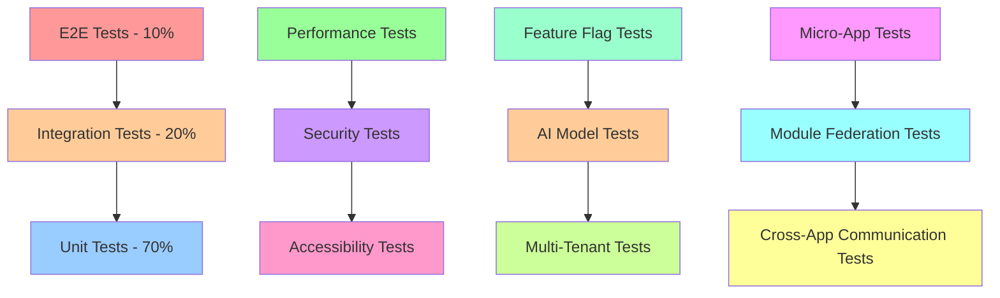

# 🧪 Test Strategy - DealCycle CRM

## 📋 Document Information

| Field | Value |
|-------|-------|
| **Document Type** | Test Strategy |
| **Project** | DealCycle CRM |
| **Version** | 1.0 |
| **Created** | 2024-12-19 |
| **Owner** | QA Architect |
| **Status** | Active |

---

## 🎯 Test Strategy Overview

**Objective:** Establish a comprehensive, multi-layered testing strategy that ensures code quality, system reliability, and user satisfaction across all components of the DealCycle CRM platform. This strategy integrates testing early in the development lifecycle and provides continuous quality assurance.

**Quality Goals:**
- **Code Coverage:** > 90% across all modules
- **Performance:** < 3 second response times
- **Reliability:** 99.9% uptime
- **Security:** Zero critical vulnerabilities
- **User Experience:** > 90% satisfaction rate

---

## 🏗️ Testing Architecture

### **Testing Pyramid**



### **Test Layers**

#### **1. Unit Tests (70%)**
- **Backend:** NestJS services, controllers, utilities
- **Frontend:** React components, hooks, utilities
- **Mobile:** React Native components, services
- **Micro-Apps:** Individual app components and services
- **Coverage:** > 90% for critical paths

#### **2. Integration Tests (20%)**
- **API Testing:** Endpoint functionality and data flow
- **Database Integration:** Data persistence and queries
- **External Services:** Twilio, Google OAuth, AI services
- **Feature Flag Integration:** Flag behavior and fallbacks
- **Micro-App Integration:** Cross-app communication and data sharing

#### **3. End-to-End Tests (10%)**
- **User Workflows:** Complete user journeys
- **Cross-Platform:** Desktop and mobile scenarios
- **Multi-Tenant:** Tenant isolation and data segregation
- **Real-World Scenarios:** Production-like environments
- **Micro-App Workflows:** End-to-end micro-app interactions

---

## 🔧 Testing Technologies

### **Backend Testing Stack**
```typescript
// Testing Framework
- Jest: Unit and integration testing
- Supertest: API endpoint testing
- MongoDB Memory Server: Database testing
- Redis Mock: Cache testing

// Test Utilities
- Factory Bot: Test data generation
- Faker.js: Realistic test data
- Testcontainers: External service mocking
- Pactum: API contract testing
```

### **Frontend Testing Stack**
```typescript
// Testing Framework
- Jest: Unit testing
- React Testing Library: Component testing
- Playwright: E2E testing
- MSW: API mocking

// Test Utilities
- Testing Library: User-centric testing
- Jest DOM: DOM testing utilities
- MSW: Service worker for API mocking
- Chromatic: Visual regression testing
```

### **Mobile Testing Stack**
```typescript
// Testing Framework
- Jest: Unit testing
- Detox: E2E testing
- React Native Testing Library: Component testing
- Maestro: Mobile workflow testing

// Test Utilities
- React Native Flipper: Debugging
- Metro: Bundler testing
- AsyncStorage Mock: Storage testing
```

### **Micro-App Testing Stack**
```typescript
// Testing Framework
- Jest: Unit testing for individual micro-apps
- Module Federation Testing: Cross-app module loading
- Webpack Module Federation: Federation configuration testing
- Single-SPA Testing: Micro-frontend framework testing

// Test Utilities
- Module Federation Plugin: Federation setup testing
- Shared Dependency Testing: Common library testing
- Cross-App Communication Testing: Event bus and messaging
- Micro-App Isolation Testing: App boundary testing
```

### **Performance Testing Stack**
```typescript
// Load Testing
- Artillery: API load testing
- k6: Performance testing
- Lighthouse: Web performance
- React DevTools: Component profiling

// Monitoring
- Prometheus: Metrics collection
- Grafana: Performance dashboards
- New Relic: APM monitoring
```

---

## 📊 Test Categories

### **1. Functional Testing**

#### **Unit Tests**
```typescript
// Example: Lead Service Unit Test
describe('LeadService', () => {
  let service: LeadService;
  let mockRepository: jest.Mocked<LeadRepository>;

  beforeEach(async () => {
    const module = await Test.createTestingModule({
      providers: [
        LeadService,
        {
          provide: LeadRepository,
          useValue: createMockRepository(),
        },
      ],
    }).compile();

    service = module.get<LeadService>(LeadService);
    mockRepository = module.get(LeadRepository);
  });

  describe('createLead', () => {
    it('should create a lead with valid data', async () => {
      const leadData = createValidLeadData();
      const expectedLead = createExpectedLead(leadData);

      mockRepository.create.mockResolvedValue(expectedLead);

      const result = await service.createLead(leadData);

      expect(result).toEqual(expectedLead);
      expect(mockRepository.create).toHaveBeenCalledWith(leadData);
    });

    it('should throw error for invalid lead data', async () => {
      const invalidData = createInvalidLeadData();

      await expect(service.createLead(invalidData))
        .rejects
        .toThrow(ValidationError);
    });
  });
});
```

#### **Integration Tests**
```typescript
// Example: Lead API Integration Test
describe('LeadController (e2e)', () => {
  let app: INestApplication;
  let authToken: string;

  beforeAll(async () => {
    const moduleFixture = await Test.createTestingModule({
      imports: [AppModule],
    }).compile();

    app = moduleFixture.createNestApplication();
    await app.init();

    authToken = await getAuthToken(app);
  });

  describe('/leads (POST)', () => {
    it('should create a new lead', async () => {
      const leadData = createValidLeadData();

      const response = await request(app.getHttpServer())
        .post('/leads')
        .set('Authorization', `Bearer ${authToken}`)
        .send(leadData)
        .expect(201);

      expect(response.body).toMatchObject({
        id: expect.any(String),
        property_address: leadData.property_address,
        owner_name: leadData.owner_name,
        status: 'new',
      });
    });

    it('should enforce tenant isolation', async () => {
      const otherTenantToken = await getAuthToken(app, 'other-tenant');
      const leadData = createValidLeadData();

      const response = await request(app.getHttpServer())
        .post('/leads')
        .set('Authorization', `Bearer ${otherTenantToken}`)
        .send(leadData)
        .expect(201);

      // Verify lead belongs to correct tenant
      expect(response.body.tenant_id).toBe('other-tenant');
    });
  });
});
```

### **2. Performance Testing**

#### **Load Testing**
```typescript
// Example: Artillery Load Test Configuration
config:
  target: 'https://api.dealcycle-crm.com'
  phases:
    - duration: 60
      arrivalRate: 10
      name: "Warm up"
    - duration: 300
      arrivalRate: 50
      name: "Sustained load"
    - duration: 120
      arrivalRate: 100
      name: "Peak load"

scenarios:
  - name: "Lead Management"
    weight: 70
    flow:
      - post:
          url: "/auth/login"
          json:
            email: "{{ $randomEmail() }}"
            password: "{{ $randomPassword() }}"
      - get:
          url: "/leads"
      - post:
          url: "/leads"
          json:
            property_address: "{{ $randomAddress() }}"
            owner_name: "{{ $randomName() }}"

  - name: "Analytics Dashboard"
    weight: 30
    flow:
      - get:
          url: "/analytics/dashboard"
      - get:
          url: "/analytics/reports"
```

#### **Performance Benchmarks**
```typescript
// Performance Test Suite
describe('Performance Benchmarks', () => {
  it('should load dashboard within 3 seconds', async () => {
    const startTime = Date.now();
    
    await request(app.getHttpServer())
      .get('/dashboard')
      .set('Authorization', `Bearer ${authToken}`)
      .expect(200);

    const loadTime = Date.now() - startTime;
    expect(loadTime).toBeLessThan(3000);
  });

  it('should handle concurrent lead creation', async () => {
    const concurrentRequests = 50;
    const promises = Array(concurrentRequests).fill(null).map(() =>
      request(app.getHttpServer())
        .post('/leads')
        .set('Authorization', `Bearer ${authToken}`)
        .send(createValidLeadData())
    );

    const results = await Promise.all(promises);
    const successfulRequests = results.filter(r => r.status === 201);
    
    expect(successfulRequests.length).toBe(concurrentRequests);
  });
});
```

### **3. Security Testing**

#### **Authentication & Authorization**
```typescript
// Security Test Suite
describe('Security Tests', () => {
  it('should prevent unauthorized access', async () => {
    await request(app.getHttpServer())
      .get('/leads')
      .expect(401);
  });

  it('should enforce tenant isolation', async () => {
    const tenant1Token = await getAuthToken(app, 'tenant1');
    const tenant2Token = await getAuthToken(app, 'tenant2');

    // Create lead in tenant1
    const lead1 = await request(app.getHttpServer())
      .post('/leads')
      .set('Authorization', `Bearer ${tenant1Token}`)
      .send(createValidLeadData())
      .expect(201);

    // Try to access lead from tenant2
    await request(app.getHttpServer())
      .get(`/leads/${lead1.body.id}`)
      .set('Authorization', `Bearer ${tenant2Token}`)
      .expect(404);
  });

  it('should validate input data', async () => {
    const maliciousData = {
      property_address: "<script>alert('xss')</script>",
      owner_name: "'; DROP TABLE leads; --"
    };

    await request(app.getHttpServer())
      .post('/leads')
      .set('Authorization', `Bearer ${authToken}`)
      .send(maliciousData)
      .expect(400);
  });
});
```

### **4. Feature Flag Testing**

#### **Flag Behavior Testing**
```typescript
// Feature Flag Test Suite
describe('Feature Flag Tests', () => {
  it('should enable features based on flags', async () => {
    // Enable AI scoring flag
    await setFeatureFlag('ai-lead-scoring', true);

    const response = await request(app.getHttpServer())
      .post('/leads')
      .set('Authorization', `Bearer ${authToken}`)
      .send(createValidLeadData())
      .expect(201);

    expect(response.body.lead_score).toBeDefined();
  });

  it('should fallback when flags are disabled', async () => {
    // Disable AI scoring flag
    await setFeatureFlag('ai-lead-scoring', false);

    const response = await request(app.getHttpServer())
      .post('/leads')
      .set('Authorization', `Bearer ${authToken}`)
      .send(createValidLeadData())
      .expect(201);

    expect(response.body.lead_score).toBeUndefined();
  });

  it('should support gradual rollouts', async () => {
    // Set flag for 50% of users
    await setFeatureFlag('ai-lead-scoring', true, { rollout: 50 });

    const responses = await Promise.all(
      Array(100).fill(null).map(() =>
        request(app.getHttpServer())
          .post('/leads')
          .set('Authorization', `Bearer ${authToken}`)
          .send(createValidLeadData())
      )
    );

    const enabledCount = responses.filter(r => r.body.lead_score).length;
    expect(enabledCount).toBeGreaterThan(40);
    expect(enabledCount).toBeLessThan(60);
  });
});
```

### **5. AI Model Testing**

#### **Model Accuracy Testing**
```typescript
// AI Model Test Suite
describe('AI Model Tests', () => {
  it('should provide accurate lead scoring', async () => {
    const testLeads = createTestLeadDataset();
    const predictions = await Promise.all(
      testLeads.map(lead => 
        aiService.scoreLead(lead)
      )
    );

    const accuracy = calculateAccuracy(predictions, testLeads.actualScores);
    expect(accuracy).toBeGreaterThan(0.85);
  });

  it('should handle edge cases gracefully', async () => {
    const edgeCaseLeads = [
      { property_address: '', owner_name: '' },
      { property_address: null, owner_name: null },
      { property_address: 'Invalid Address', owner_name: 'Test' }
    ];

    const predictions = await Promise.all(
      edgeCaseLeads.map(lead => 
        aiService.scoreLead(lead)
      )
    );

    predictions.forEach(prediction => {
      expect(prediction.score).toBeGreaterThanOrEqual(0);
      expect(prediction.score).toBeLessThanOrEqual(100);
    });
  });
});
```

### **6. Micro-App Testing**

#### **Individual App Testing**
```typescript
// Micro-App Unit Test Example
describe('LeadManagementApp', () => {
  let app: MicroApp;
  let container: HTMLElement;

  beforeEach(() => {
    container = document.createElement('div');
    app = new LeadManagementApp(container);
  });

  it('should initialize micro-app correctly', () => {
    expect(app.isInitialized()).toBe(true);
    expect(container.querySelector('[data-testid="lead-app"]')).toBeInTheDocument();
  });

  it('should handle app lifecycle events', () => {
    const lifecycleSpy = jest.fn();
    app.onLifecycleEvent(lifecycleSpy);

    app.mount();
    expect(lifecycleSpy).toHaveBeenCalledWith('mounted');

    app.unmount();
    expect(lifecycleSpy).toHaveBeenCalledWith('unmounted');
  });

  it('should communicate with host application', () => {
    const messageSpy = jest.fn();
    window.addEventListener('micro-app-message', messageSpy);

    app.sendMessage('lead-created', { leadId: 'test-123' });
    
    expect(messageSpy).toHaveBeenCalledWith(
      expect.objectContaining({
        detail: { type: 'lead-created', payload: { leadId: 'test-123' } }
      })
    );
  });
});
```

#### **Module Federation Testing**
```typescript
// Module Federation Test Suite
describe('Module Federation', () => {
  it('should load remote modules correctly', async () => {
    const remoteModule = await import('lead-management/LeadForm');
    
    expect(remoteModule).toBeDefined();
    expect(remoteModule.default).toBeInstanceOf(Function);
  });

  it('should handle federation configuration', () => {
    const federationConfig = require('./webpack.config.js');
    
    expect(federationConfig.plugins).toContainEqual(
      expect.objectContaining({
        constructor: { name: 'ModuleFederationPlugin' }
      })
    );
  });

  it('should resolve shared dependencies', () => {
    const sharedDeps = federationConfig.plugins.find(
      p => p.constructor.name === 'ModuleFederationPlugin'
    ).options.shared;

    expect(sharedDeps).toHaveProperty('react');
    expect(sharedDeps).toHaveProperty('react-dom');
  });
});
```

#### **Cross-App Communication Testing**
```typescript
// Cross-App Communication Test Suite
describe('Cross-App Communication', () => {
  let eventBus: EventBus;
  let leadApp: LeadManagementApp;
  let analyticsApp: AnalyticsApp;

  beforeEach(() => {
    eventBus = new EventBus();
    leadApp = new LeadManagementApp(eventBus);
    analyticsApp = new AnalyticsApp(eventBus);
  });

  it('should broadcast events across apps', () => {
    const analyticsSpy = jest.fn();
    analyticsApp.onLeadCreated(analyticsSpy);

    leadApp.createLead({ property_address: '123 Main St' });
    
    expect(analyticsSpy).toHaveBeenCalledWith(
      expect.objectContaining({
        type: 'lead-created',
        payload: expect.objectContaining({
          property_address: '123 Main St'
        })
      })
    );
  });

  it('should handle app state synchronization', () => {
    const stateSpy = jest.fn();
    analyticsApp.onStateChange(stateSpy);

    leadApp.updateState({ selectedLead: 'lead-123' });
    
    expect(stateSpy).toHaveBeenCalledWith(
      expect.objectContaining({
        source: 'lead-management',
        state: { selectedLead: 'lead-123' }
      })
    );
  });

  it('should isolate app boundaries', () => {
    const isolatedEvent = { type: 'internal-event', data: 'private' };
    
    leadApp.emitInternalEvent(isolatedEvent);
    
    // Event should not propagate to other apps
    expect(analyticsApp.getInternalEvents()).not.toContain(isolatedEvent);
  });
});
```

#### **Shared State Management Testing**
```typescript
// Shared State Management Test Suite
describe('Shared State Management', () => {
  let stateManager: SharedStateManager;
  let leadApp: LeadManagementApp;
  let dashboardApp: DashboardApp;

  beforeEach(() => {
    stateManager = new SharedStateManager();
    leadApp = new LeadManagementApp(stateManager);
    dashboardApp = new DashboardApp(stateManager);
  });

  it('should synchronize shared state across apps', () => {
    leadApp.updateSharedState({ currentUser: { id: 'user-123' } });
    
    expect(dashboardApp.getSharedState()).toMatchObject({
      currentUser: { id: 'user-123' }
    });
  });

  it('should handle state conflicts gracefully', () => {
    // Simulate concurrent state updates
    leadApp.updateSharedState({ selectedLead: 'lead-1' });
    dashboardApp.updateSharedState({ selectedLead: 'lead-2' });
    
    const finalState = stateManager.getState();
    expect(finalState.selectedLead).toBeDefined();
    expect(finalState.conflictResolved).toBe(true);
  });

  it('should maintain app-specific state isolation', () => {
    leadApp.updateAppState({ internalData: 'private' });
    dashboardApp.updateAppState({ dashboardConfig: 'private' });
    
    expect(leadApp.getAppState()).toHaveProperty('internalData');
    expect(dashboardApp.getAppState()).toHaveProperty('dashboardConfig');
    expect(leadApp.getAppState()).not.toHaveProperty('dashboardConfig');
  });
});
```

#### **App Boundary Testing**
```typescript
// App Boundary Test Suite
describe('App Boundaries', () => {
  it('should prevent cross-app DOM manipulation', () => {
    const leadAppContainer = document.createElement('div');
    const dashboardAppContainer = document.createElement('div');
    
    const leadApp = new LeadManagementApp(leadAppContainer);
    const dashboardApp = new DashboardApp(dashboardAppContainer);
    
    // Lead app should not be able to modify dashboard app DOM
    expect(() => {
      leadApp.manipulateDOM(dashboardAppContainer);
    }).toThrow('Cross-app DOM manipulation not allowed');
  });

  it('should isolate CSS styles between apps', () => {
    const leadApp = new LeadManagementApp();
    const dashboardApp = new DashboardApp();
    
    leadApp.addStyles('.lead-button { color: red; }');
    dashboardApp.addStyles('.dashboard-button { color: blue; }');
    
    // Styles should be scoped to respective apps
    expect(document.querySelector('.lead-button')).toHaveStyle({ color: 'red' });
    expect(document.querySelector('.dashboard-button')).toHaveStyle({ color: 'blue' });
    expect(document.querySelector('.lead-button')).not.toHaveStyle({ color: 'blue' });
  });

  it('should handle app loading and unloading', async () => {
    const container = document.createElement('div');
    const app = new LeadManagementApp(container);
    
    await app.load();
    expect(container.querySelector('[data-testid="lead-app"]')).toBeInTheDocument();
    
    await app.unload();
    expect(container.querySelector('[data-testid="lead-app"]')).not.toBeInTheDocument();
  });
});
```

#### **Federation Configuration Testing**
```typescript
// Federation Configuration Test Suite
describe('Federation Configuration', () => {
  it('should validate webpack federation config', () => {
    const config = require('./webpack.config.js');
    const federationPlugin = config.plugins.find(
      p => p.constructor.name === 'ModuleFederationPlugin'
    );
    
    expect(federationPlugin.options).toMatchObject({
      name: 'lead-management',
      filename: 'remoteEntry.js',
      exposes: {
        './LeadForm': './src/components/LeadForm',
        './LeadList': './src/components/LeadList'
      },
      shared: {
        react: { singleton: true },
        'react-dom': { singleton: true }
      }
    });
  });

  it('should test remote module loading', async () => {
    const container = { get: jest.fn(), init: jest.fn() };
    
    // Mock webpack module federation
    window.__webpack_require__ = {
      e: jest.fn().mockResolvedValue([]),
      l: jest.fn().mockResolvedValue({ default: jest.fn() })
    };
    
    const module = await loadRemoteModule('lead-management/LeadForm');
    expect(module).toBeDefined();
  });

  it('should handle federation errors gracefully', async () => {
    // Mock failed module loading
    window.__webpack_require__ = {
      e: jest.fn().mockRejectedValue(new Error('Module not found')),
      l: jest.fn().mockRejectedValue(new Error('Load failed'))
    };
    
    await expect(loadRemoteModule('non-existent/Module'))
      .rejects
      .toThrow('Module not found');
  });
});
```

---

## 🚀 Test Automation Strategy

### **CI/CD Pipeline Integration**

```yaml
# GitHub Actions Test Workflow
name: Test Suite

on:
  push:
    branches: [main, develop]
  pull_request:
    branches: [main]

jobs:
  unit-tests:
    runs-on: ubuntu-latest
    steps:
      - uses: actions/checkout@v3
      - uses: actions/setup-node@v3
        with:
          node-version: '18'
      - run: npm ci
      - run: npm run test:unit
      - run: npm run test:coverage

  integration-tests:
    runs-on: ubuntu-latest
    services:
      mongodb:
        image: mongo:6.0
        ports:
          - 27017:27017
      redis:
        image: redis:7-alpine
        ports:
          - 6379:6379
    steps:
      - uses: actions/checkout@v3
      - run: npm run test:integration

  e2e-tests:
    runs-on: ubuntu-latest
    steps:
      - uses: actions/checkout@v3
      - run: npm run test:e2e

  performance-tests:
    runs-on: ubuntu-latest
    steps:
      - uses: actions/checkout@v3
      - run: npm run test:performance

  security-tests:
    runs-on: ubuntu-latest
    steps:
      - uses: actions/checkout@v3
      - run: npm run test:security
```

### **Test Data Management**

```typescript
// Test Data Factories
export class LeadFactory {
  static createValidLead(overrides = {}) {
    return {
      property_address: faker.address.streetAddress(),
      owner_name: faker.name.fullName(),
      owner_phone: faker.phone.number(),
      owner_email: faker.internet.email(),
      property_value: faker.number.int({ min: 50000, max: 500000 }),
      asking_price: faker.number.int({ min: 30000, max: 400000 }),
      ...overrides
    };
  }

  static createInvalidLead() {
    return {
      property_address: '',
      owner_name: '',
      property_value: -1000
    };
  }
}

export class UserFactory {
  static createUser(role = 'USER', tenantId = 'default-tenant') {
    return {
      email: faker.internet.email(),
      firstName: faker.name.firstName(),
      lastName: faker.name.lastName(),
      roles: [role],
      tenant_id: tenantId,
      status: 'active'
    };
  }
}
```

---

## 📊 Test Metrics & Reporting

### **Quality Metrics Dashboard**

```typescript
// Test Metrics Collection
interface TestMetrics {
  coverage: {
    unit: number;
    integration: number;
    e2e: number;
    total: number;
  };
  performance: {
    responseTime: number;
    throughput: number;
    errorRate: number;
  };
  security: {
    vulnerabilities: number;
    criticalIssues: number;
    complianceScore: number;
  };
  reliability: {
    uptime: number;
    availability: number;
    mttr: number; // Mean Time To Recovery
  };
}
```

### **Test Reporting**

```typescript
// Test Report Generator
class TestReportGenerator {
  async generateReport(testResults: TestResults): Promise<TestReport> {
    return {
      summary: {
        totalTests: testResults.total,
        passed: testResults.passed,
        failed: testResults.failed,
        coverage: testResults.coverage,
        duration: testResults.duration
      },
      details: {
        unitTests: this.analyzeUnitTests(testResults.unit),
        integrationTests: this.analyzeIntegrationTests(testResults.integration),
        e2eTests: this.analyzeE2ETests(testResults.e2e),
        performanceTests: this.analyzePerformanceTests(testResults.performance),
        securityTests: this.analyzeSecurityTests(testResults.security)
      },
      recommendations: this.generateRecommendations(testResults)
    };
  }
}
```

---

## 🔄 Test Maintenance Strategy

### **Test Maintenance Schedule**

| Test Type | Frequency | Owner | Tools |
|-----------|-----------|-------|-------|
| Unit Tests | Continuous | Developers | Jest, Coverage |
| Integration Tests | Daily | QA Team | Supertest, Pactum |
| E2E Tests | Weekly | QA Team | Playwright, Detox |
| Micro-App Tests | Daily | Micro-App Teams | Jest, Module Federation |
| Cross-App Integration | Weekly | Integration Team | Event Bus, State Manager |
| Performance Tests | Weekly | DevOps | Artillery, k6 |
| Security Tests | Monthly | Security Team | OWASP ZAP, Snyk |

### **Test Debt Management**

```typescript
// Test Debt Tracker
interface TestDebt {
  id: string;
  category: 'unit' | 'integration' | 'e2e' | 'performance' | 'security';
  severity: 'low' | 'medium' | 'high' | 'critical';
  description: string;
  impact: string;
  effort: number; // hours
  priority: number;
  assignedTo: string;
  dueDate: Date;
  status: 'open' | 'in-progress' | 'resolved';
}
```

---

## 🎯 Success Criteria

### **Quality Gates**

1. **Code Coverage:** > 90% for all critical modules
2. **Test Execution:** All tests pass before deployment
3. **Performance:** Response times < 3 seconds
4. **Security:** Zero critical vulnerabilities
5. **Reliability:** 99.9% uptime target

### **Continuous Improvement**

1. **Weekly Test Reviews:** Analyze test results and coverage
2. **Monthly Test Strategy Updates:** Adapt to new requirements
3. **Quarterly Test Automation Improvements:** Enhance test efficiency
4. **Annual Test Strategy Refresh:** Align with business goals

---

**This comprehensive test strategy ensures the DealCycle CRM platform meets the highest standards of quality, reliability, and user satisfaction while supporting rapid development and safe deployments.** 